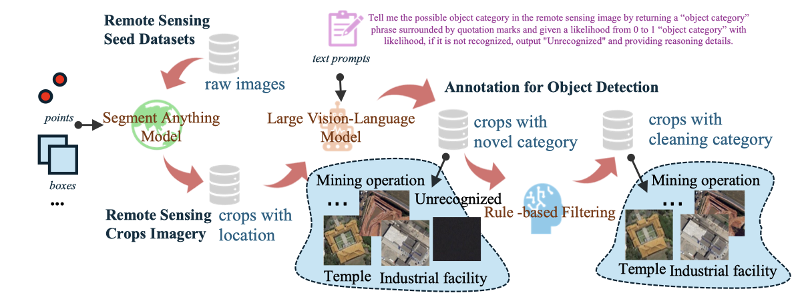

<h1 align="center"> LAE-Label: A Data Annotation Engine powered by Large Models</h1>

<a href="http://arxiv.org/abs/2408.09110">"></a>

<h4 align="center"><em>Jiancheng Pan, Yanxing Liu</em></h4>

    <a href="#news">News</a> |
  <a href="#abstract">Abstract</a> |
  <a href="#usage">Usage</a> |
  <a href="#results">Results</a> |
  <a href="#statement">Statement</a>

## News

## Abstract
Large models such as CLIP (Radford et al. 2021) and GPT (Radford et al. 2018) are empowered to change the current paradigm by the Emergent Ability due to the massive amounts of data fed to them for training. Then came a bunch of visionrelated large models with data-driven large-scale training, e.g., SAM (Kirillov et al. 2023), InternVL (Chen et al. 2024), etc. Due to the tremendous zero-shot identification ability of the models, some works are based on these models as data engines for automated data labeling. Wang et al. leverage SAM and existing remote sensing object detection datasets to build a pipeline for generating a large-scale remote sensing segmentation dataset SAMRS (Wang et al. 2023). Huang et al. explores the potential application of SAM to process medical images for fine-grained segmentation. As the accuracy requirements of the segmentation task are high, if it is used directly for labeling without adding human checks, it may still be limited in real segmentation.

SAM can sense the exact object edge under the specified point or box prompts but is unaware of the specific category. Large Vision-Language Models (LVLMs), such as CLIP, InternVL, etc., can recognize the relationship between images and text because of their alignment training in largescale web image-text pair data. Although some work has attempted to give SAM the ability to perceive categories (Chen, Yang, and Zhang 2023), this ability is not mature enough for actual segmentation in remote sensing, and the segmentation quality is degraded. Combined with SAM and LVLMs capabilities, good quality raw labeled data can be obtained.

    

## Usage

## Results

## Statement

### Citation

### Acknowledgement